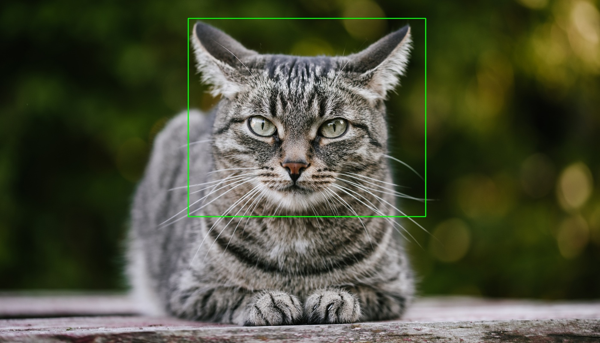

# ClipRCNN: CLIP guided zero-shot object detector.

<p align="center">
  
</p>

Tiny implementation of the object detector based on Selective Search region proposals and CLIP guided loss.
Our detector supports both text and image user's prompts.

## Usage

### Install requirements

```bash
$ pip install -r requirements.txt
```

### Detect objects

```bash
$ python run.py --help

usage: run.py [-h] [-i IMAGE] [--device DEVICE] [--text-prompt TEXT_PROMPT] [--image-prompt IMAGE_PROMPT] [--clip-type CLIP_TYPE] [--batch-size BATCH_SIZE] [--scale SCALE] [--sigma SIGMA] [--min-size MIN_SIZE]
              [--aspect-ratio ASPECT_RATIO] [--top-k TOP_K] [--output-image OUTPUT_IMAGE]

optional arguments:
  -h, --help            show this help message and exit
  -i IMAGE, --image IMAGE
                        Input image.
  --device DEVICE       inference device.
  --text-prompt TEXT_PROMPT
                        Text prompt.
  --image-prompt IMAGE_PROMPT
                        Image prompt.
  --clip-type CLIP_TYPE
                        Type of CLIP model [clip, ruclip].
  --batch-size BATCH_SIZE
                        Batch size.
  --scale SCALE         Scale (selective search).
  --sigma SIGMA         Sigma (selective search).
  --min-size MIN_SIZE   Minimum area of the region proposal (selective search).
  --aspect-ratio ASPECT_RATIO
                        Aspect ratio (selective search).
  --top-k TOP_K         top k predictions will be return.
  --output-image OUTPUT_IMAGE
                        Output image name.
```

```bash
$ python run.py -i <input_image_path> --text-prompt "red cup" --output-name output.png
```
